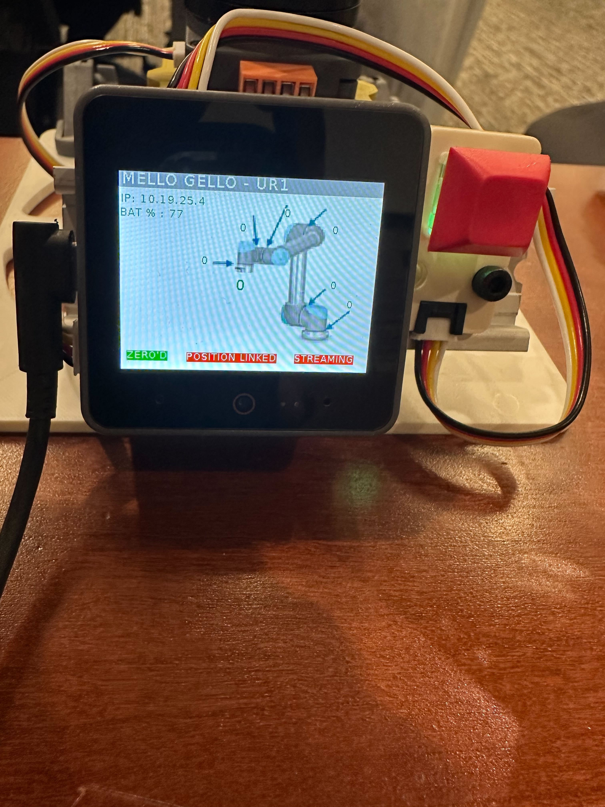

# UR5e Real Robot Setup

This guide covers (1) configuring the UR5e and Robotiq 2F-85 for external control, and (2) Mello teleop for demos and verification.

---

## Part 1: UR5e and gripper configuration

The arm must be configured for external control so this codebase can send commands over RTDE. Do the following on the UR5e pendant.

### 1. Network and security (pendant)

* Switch to **Manual** mode → **Settings**.
* **System**: Enable **Remote Control** and **Constrained Freedrive**.
* **Security**: Leave **Restrict inbound network access to this subnet** and **Disable inbound access to additional interfaces** blank; under **Services**, enable all.
* **Network**: Set to **Static**. Example (adjust last octet for your robot):
  ```
  IP: 192.168.1.10   Subnet: 255.255.255.0   Gateway: 0.0.0.0   DNS: 0.0.0.0
  ```

### 2. PC network

* Connect the PC to the UR5e with Ethernet.
* Set the PC’s Ethernet IPv4 to **Manual**, same subnet, e.g. `192.168.1.11` / `255.255.255.0` (use a different last octet than the robot).
* Verify: `ping 192.168.1.10` (robot IP).

### 3. External Control URCap

* Install the [Universal Robots External Control URCap](https://github.com/UniversalRobots/Universal_Robots_ExternalControl_URCap) from a USB drive via the pendant.
* **Installation** → **URCaps** → **External Control**: set **Host IP** and **Host Name** to the PC’s IP (e.g. `192.168.1.11`), **Custom Port** `30004`.

### 4. Robotiq 2F-85 gripper

* Install the Robotiq gripper URCap from [Robotiq support](https://robotiq.com/support) (USB drive).
* **Installation** → **URCaps** → **Gripper** → **Scan**, then select and configure the 2F-85.

After this, the arm and gripper are ready for teleop and policy control.

---

## Part 2: Mello teleop

Teleoperate the UR5e with the Mello controller for demos and verification.

### Prerequisites

- Diffusion policy conda env activated (e.g. `conda activate robodiff`)
- UR5e powered on and reachable at `robot_ip`
- RealSense cameras connected (for demo recording)

### 1. Mello setup

**Calibrate Mello**

1. Place Mello in the calibration position as in the images below.
2. Hold that pose and press and hold the red button for a few seconds.


When calibration succeeds, the ZERO indicator on the screen turns green.



**Stream joint positions**

1. **USB permissions** (once per session or set udev rule):
   ```bash
   sudo chmod 777 /dev/serial/by-id/usb-M5Stack_Technology_Co.__Ltd_M5Stack_UiFlow_2.0_24587ce945900000-if00
   ```
2. **Start streaming**: Double-tap the red button. The streaming indicator on the screen turns green.


3. **Test connection**:
   ```bash
   python tests/test_mello.py
   ```
   Joint positions should print in real time.

### 2. Run teleop

From the diffusion_policy repo root:

```bash
python demo_real_robot.py -o <output_dir> --robot_ip <ur5e_ip>
```

Example:

```bash
python demo_real_robot.py -o /tmp/demo --robot_ip 192.168.1.10
```

- **Recording**: Focus the OpenCV window. Press **C** to start, **S** to stop, **Backspace** to drop the last episode, **Q** to quit.

### 3. If the robot stalls or feels sluggish

Tune the OSC gains:

```bash
python demo_real_robot.py -o <output_dir> --robot_ip <ur5e_ip> \
    --osc_kp_pos 1200 --osc_kp_rot 60
```

Defaults are `--osc_kp_pos 1000`, `--osc_kp_rot 50`. Increase in small steps until the arm follows the Mello smoothly without stalling.

For gripper open/close thresholds, edit `open_gripper` / `close_gripper` in `diffusion_policy/real_world/real_env.py`.
